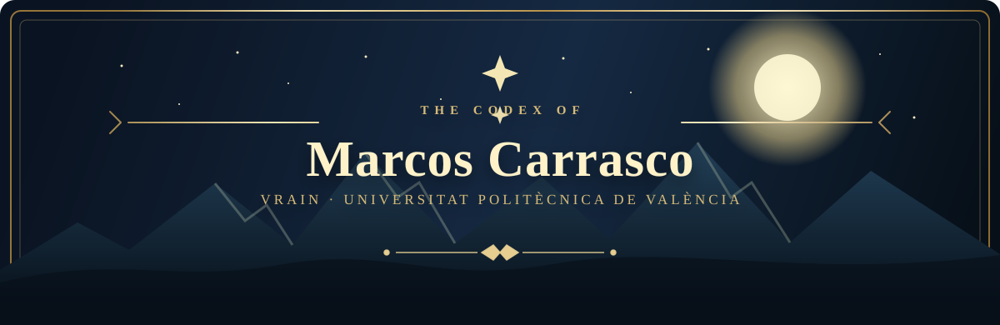

<!-- A profile README for github.com/TheDeath246 -->

  

  <i>«Cada línea de código es una runa; cada proyecto, una nueva crónica.»</i>

  
  
  

## ✦ El pergamino

Soy **Marcos Carrasco**. Desde València, exploro el oficio de crear con tecnología, curiosidad y propósito. Este perfil reúne mis proyectos, experimentos y las cosas que voy aprendiendo por el camino.

> *El conocimiento no se guarda en cofres: se comparte, se prueba y se mejora.*

## ⚜ La alianza

<table>
  <tr>
    <td width="50%" align="center">
      <a href="https://vrain.upv.es/"><strong>VRAIN</strong></a> 
      Valencian Research Institute for Artificial Intelligence  
      Investigación e innovación en inteligencia artificial.
    </td>
    <td width="50%" align="center">
      <a href="https://www.upv.es/"><strong>UPV</strong></a> 
      Universitat Politècnica de València  
      Ingeniería, conocimiento y vocación de futuro.
    </td>
  </tr>
</table>

## ⚔ La misión

- Aprender de cada desafío y convertir las ideas en proyectos útiles.
- Explorar el potencial de la inteligencia artificial de forma responsable.
- Compartir el camino: código, hallazgos y pequeñas victorias.

## 🗺️ El mapa

Aquí encontrarás proyectos y experimentos que irán poblando este repositorio. Si alguna idea te parece digna de una nueva aventura, abre una *issue* o visita [@TheDeath246](https://github.com/TheDeath246).

  ✦ Forjado en la UPV · Con la mirada puesta en VRAIN ✦

